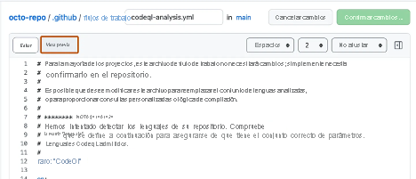
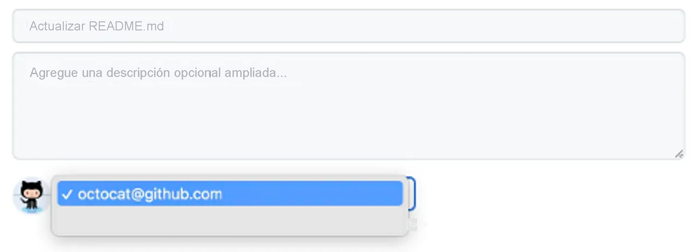

### Adición de un archivo al repositorio

Los archivos en GitHub pueden hacer algunas cosas, pero su propósito principal es almacenar datos e información sobre su proyecto.

Vamos a repasar cómo agregar un archivo al repositorio.

Pero antes de empezar, conviene saber que para agregar un archivo a un repositorio primero debe tener un acceso mínimo de escritura dentro del repositorio al que desea añadir un archivo.

1. En GitHub.com, vaya a la página principal del repositorio.

2. En tu repositorio, dirígete a la carpeta en la que deseas crear un archivo.

3. Sobre la lista de archivos, seleccione el menú desplegable Agregar archivo ᐁ y, a continuación, seleccione Crear nuevo archivo. Es posible que también tenga un vínculo de Introducción mediante la creación de un nuevo archivo. Como alternativa, puede seleccionar el icono más (+) en la vista de árbol de archivos de la izquierda.

4. En el campo de nombre, teclea el nombre y la extensión del archivo. Para crear subdirectorios, escriba el separador de directorios /.

5. En el cuadro de texto de contenido del archivo, escribe el contenido del archivo.

6. Para revisar el nuevo contenido, encima del contenido del archivo, seleccione Vista previa.

7. Seleccione Commit changes (Confirmar cambios).

8. En el campo Confirmar mensaje, escriba un mensaje de confirmación breve y significativo que describa el cambio realizado en el archivo. Puedes atribuir el cambio a mas de un autor en el mensaje del mismo.

9. Si tiene más de una dirección de correo electrónico asociada a su cuenta en GitHub.com, seleccione el menú desplegable de dirección de correo electrónico y seleccione la dirección de correo electrónico que se usará como dirección de correo electrónico del autor de Git. Únicamente las direcciones de correo electrónico verificadas aparecen en el menú desplegable. Si ha habilitado la privacidad de la dirección de correo electrónico, entonces [nombreDeUsuario]@usuarios.noreply.github.com es la dirección de correo electrónico predeterminada del autor de la confirmación.

10. Debajo de los campos Mensaje de confirmación, decida si desea agregar la confirmación a la rama actual o a una nueva rama. Si tu rama actual es la rama predeterminada, debes elegir crear una nueva rama para tu confirmación y después crear una solicitud de extracción.

11. Seleccione Confirmar cambios o Proponer cambios.

¡Enhorabuena, acaba de crear un nuevo archivo en el repositorio! También ha creado una nueva rama y ha realizado un commit.

Pero antes de revisar las ramas y los commits en la siguiente unidad, revisemos rápidamente las gists, wikis y páginas de GitHub porque son similares a los repositorios.